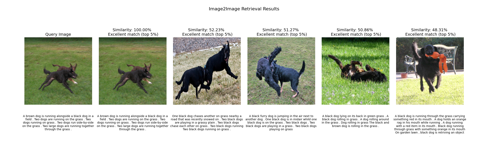
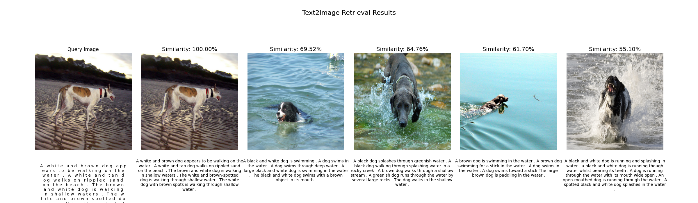
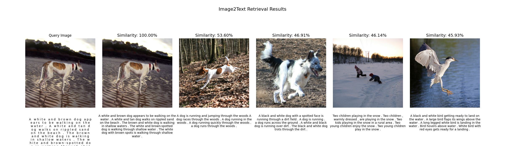
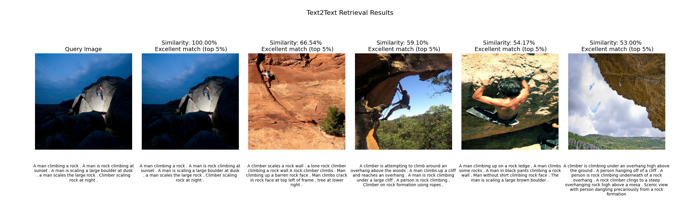
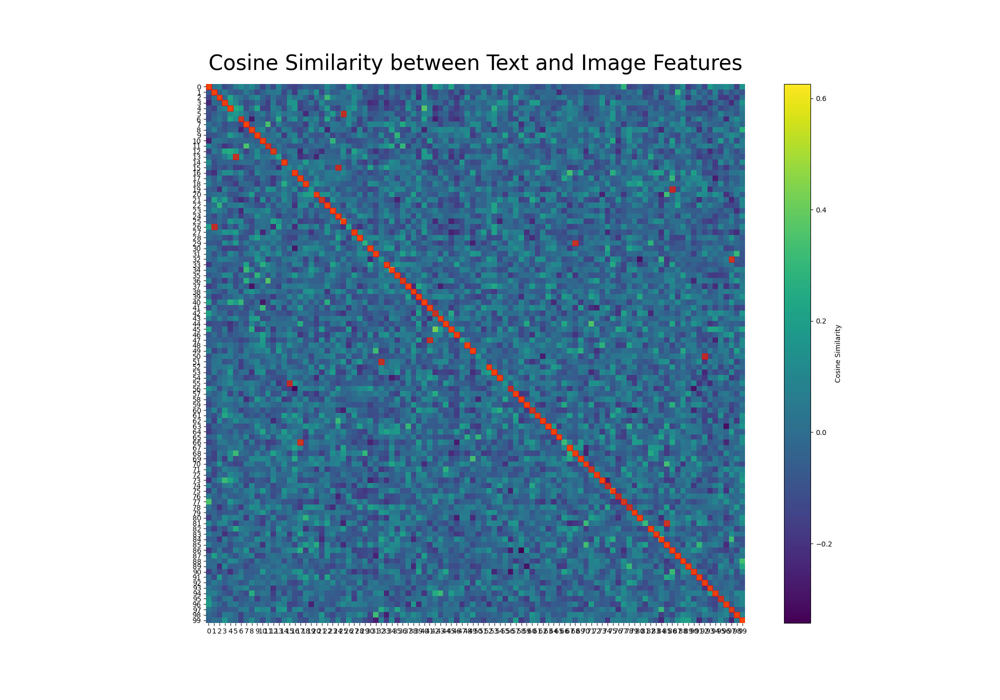
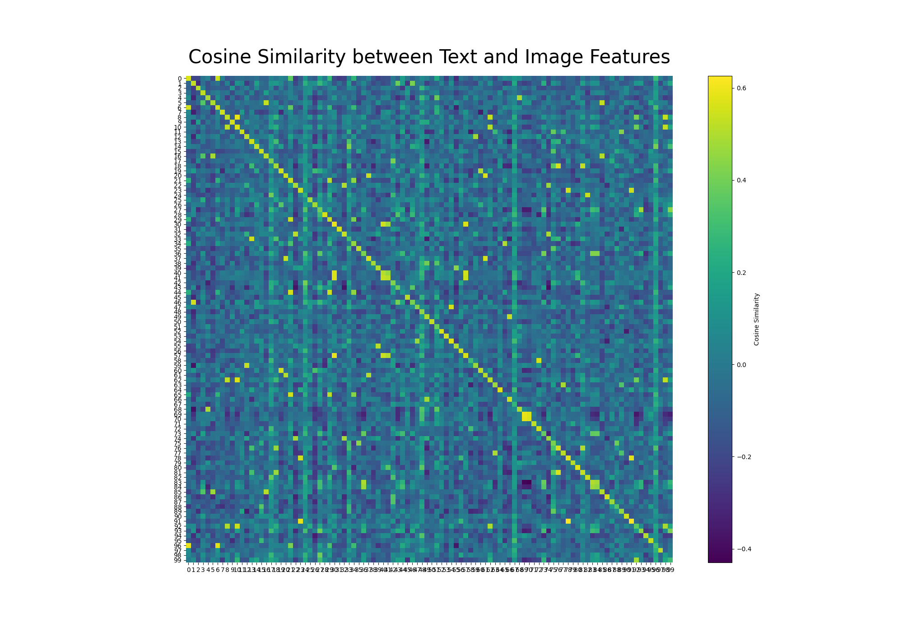

<div align="center">

# Base CLIP — Contrastive Language-Image Pre-training

<a href="https://www.python.org/"></a>
<a href="https://pytorch.org/get-started/locally/"></a>

</div>

---

## 📌 Introduction

This repository contains a **simple base implementation** of a general **CLIP-style contrastive learning pipeline**. It aligns embeddings from two separate encoders (e.g., *images and text*, or *any two modalities*) so that **matching pairs** produce **similar embeddings** in a shared latent space.

CLIP uses a **contrastive loss** that **maximizes the cosine similarity** between the *N* true (positive) pairs in a batch while **minimizing similarity** among the *N² − N* incorrect (negative) pairs. This optimization is implemented as a **symmetric cross-entropy loss** over the cosine similarity matrix of all possible pairs between the two modalities.

---

## 🚀 Key Features

- Encodes **two modalities** (e.g., image/text or fMRI/behavior) into a shared embedding space via lightweight **linear projection heads**.  
- Trains using a **CLIP-style contrastive loss** to maximize similarity for matched pairs and minimize it for mismatched ones.  
- Supports **training, validation, and inference**, with **Weights & Biases** logging and checkpointing to `results/`.  
- Includes **retrieval utilities** to search nearest neighbors in the learned multimodal space.  

> This is a **baseline implementation** — two projection heads align pretrained encoders.  
> For better results, consider **fine-tuning** the final layers of the encoders (e.g., text or fMRI encoder).  
> Current encoders are simple and can be improved (e.g., by leveraging the **[SWIN 4D Encoder](https://github.com/gillet-thomas/SWIN)**).

---

## 📁 Project Structure

```
CLIPBase/
├── configs/
│   └── config.yaml           # Main config (datasets, encoders, heads, training params)
├── src/
│   ├── Trainer.py            # AMP-enabled training with WandB logging
│   ├── models/
│   │   ├── CLIP_model.py     # Projection heads + contrastive CLIP loss
│   │   ├── Encoders.py       # Image/Text encoders (timm, DistilBERT, etc.)
│   │   ├── CLIP_retrieval.py     # Retrieval (Flickr)
│   │   └── CLIP_retrievalIN.py   # Retrieval (ImageNet)
│   └── data/
│       ├── DatasetFLICKR.py      # Flickr8k pairs
│       ├── DatasetImageNet.py    # ImageNet embeddings
│       ├── DatasetABCDE.py       # fMRI/sMRI + behavioral data (pain scores)
│       └── DatasetABCDETime.py   # Temporal variant (optional)
├── results/                  # Model checkpoints
├── wandb/                    # WandB metadata
└── main.py                   # Entry point for training/inference
```

---

## 💻 Getting Started

### Train

```
python main.py "run_name" --cuda 0
```

Process: loads the configuration and dataset, initializes the CLIP model with projection heads, trains using the contrastive loss, and saves the resulting checkpoint to `results/model.pth`.

> 💡 Tip: Enable `generate_data: true` during the first run to precompute and cache embeddings.

---

### Inference / Retrieval

```
python main.py --inference --wandb false
```

This command loads the trained checkpoint from `results/model.pth` and performs retrieval using `CLIPRetrieval` or `CLIPRetrievalIN`.  
It generates similarity matrices and displays nearest-neighbor retrieval results across modalities.

---

## ⚙️ Configuration (configs/config.yaml)

- **Global:** `output_dir`, `generate_data`, `training_enabled`, `wandb_enabled`, `seed`
- **Dataset:** `dataset_name`, dataset paths
- **Training:** `learning_rate`, `epochs`, `batch_size`, `weight_decay`, `val_interval`
- **Model:** `projection_dim`, `image_encoder` (e.g., `resnet50`, `vit_base_patch16_224`), `text_encoder`, embedding dims

Runtime flags (from `main.py`):
- `name` → WandB run name  
- `--cuda` → GPU index  
- `--wandb` → Enable/disable logging  
- `--inference` → Skip training and run retrieval  

---

## 📊 Compatible Datasets

### Flickr8k (Image–Caption Alignment)

Set in `configs/config.yaml`:
- `dataset_name: "FLICKR"`
- `dataset_flickr`: path to Flickr root (`Images/` and `captions.txt`)
- `dataset_flickr_pickle`: optional cache for precomputed embeddings
- Encoders: `resnet50` (2D CNN), `distilbert` (Text encoder), `Qwen2.5-1.5B-Instruct`(Text summarizer).

Expected layout:
```
<dataset_flickr>/
  Images/
    1000268201_693b08cb0e.jpg
    ...
  captions.txt  # CSV-like: image, caption
```

> Note: if `generate_data: true`, embeddings are cached for faster reuse.

### ImageNet

- Set `dataset_name: "IMAGENET"`. 
- Use the configuration file `configs/config_imagenet.yaml` for pre-set parameters and paths

### ABCDE (fMRI/MRI + Behavioral Data)

Implemented in `src/data/DatasetABCDE.py`:
- `dataset_abcde`: NIfTI volumes, e.g. `src/data/abcde/resampled/*.nii`
- `pain_scores.xlsx`: behavioral vectors
- Encoders: `fmrisEncoder` (3D CNN) and `painEncoder` (MLP)

> Note: `main.py` currently implements only the `FLICKR` and `IMAGENET` datasets.  
> To run ABCDE, extend the `get_datasets()` function with the corresponding Dataset class.

---

## 📊 Results

Please find below several test cases demonstrating multimodal alignment.  
Additional results and visualizations can be found in the `results/` directory.

## 🔹 Retrieval Examples

- **Image → Image** retrieval (FLICKR dataset)  
  Find visually or semantically similar images in the learned embedding space.
  

- **Text → Image** retrieval (FLICKR dataset)  
  Retrieve the most relevant image(s) given a text query (e.g., caption).
  
  
- **Image → Text** retrieval (FLICKR dataset)   
  Retrieve the caption or description that best matches a given image.
  

- **Text → Text** retrieval (FLICKR dataset)  
  Retrieve semantically similar sentences or behavioral descriptions.
  
  
All retrieval types rely on **cosine similarity** in the shared embedding space.

## 🔹 Similarity Matrix

During inference, the system computes a **similarity matrix** across all image–text pairs:

<table align="center" style="border-collapse: collapse;">
  <tr>
    <td style="border: 1px solid #ccc; padding: 5px; text-align: center;">
      
    </td>
    <td style="border: 1px solid #ccc; padding: 5px; text-align: center;">
      
    </td>
  </tr>
</table>

_CLIP Similarity Matrix on Flickr (left) and ImageNet (right) datasets_

This matrix encodes the pairwise cosine similarity between every element of both modalities

---

## 📈 Experimental Notes

- Works well with **Flickr8k** and **ImageNet** for baseline image–text alignment  
- Medical datasets (fMRI/MRI) included for experimentation  
- Current performance limited by **simple encoders** and **projection-only alignment**  
- Future improvements:
  - Fine-tune encoder layers for deeper fine-tuning (not just projection heads)
  - Integrate **[Swift Encoder](https://github.com/gillet-thomas/SWIN)** for medical modalities  

